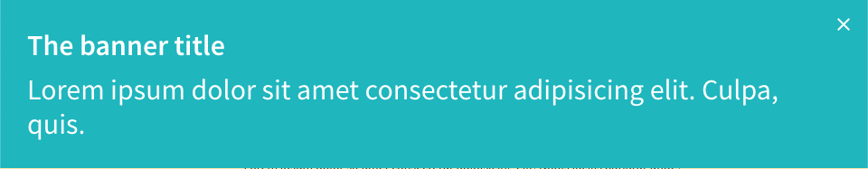

import Tabs from '@theme/Tabs';
import TabItem from '@theme/TabItem';

O componente Button é responsável por criar uma região no topo da tela com título, texto e botão de fechar. Usado muitas vezes para dar avisos importantes ao usuário como Cookies ou qual navegador usar.



## Atributos da tag

Atributo          | Input/Output   | Tipo           | Obrigatório    | Valores padrões
:---------------- | :------------: | :--------------| :------------- | :-------------
title             | `@Input`       | `String`       | Sim            | -
message           | `@Input`       | `String`       | Sim            | -
color             | `@Input`       | `String`       | Não            | aquamarine
closeButtonTitle  | `@Input`       | `String`       | Não            | Close
open              | `@Input`       | `String`       | Não            | true
close             | `@Output`      | `function`     | Não            | -

:::info Color
O atributo color aceita as cores: `aquamarine`, `red`, `gray`, `green`, `purple` e a cor padrão é `aquamarine`, esta cor será aplicada no background do banner.
:::

:::info Close
O atributo close recebe uma função que será executada quando o botão Close for pressionado. Por padrão, sempre que o botão é pressionado o banner será fechado.
:::

## Como usar

<Tabs
  defaultValue="html"
  values={[
    { label: 'HTML', value: 'html', },
    { label: 'Typescript', value: 'typescript', }
  ]
}>
<TabItem value="html">

```html
<ugl-banner
  [title]="'The banner title'"
  [message]="'Lorem ipsum dolor sit amet consectetur adipisicing elit. Culpa, quis.'"></ugl-banner>


<ugl-banner
	[title]="'The banner title'"
	[message]="'Lorem ipsum dolor sit amet consectetur adipisicing elit. Culpa, quis.'"
	[color]="'yellow'"
	colose="closeClick()"></ugl-banner>
```

</TabItem>

<TabItem value="typescript">

```typescript
closeClick() {
	console.log('Close this banner');
}
```

</TabItem>
</Tabs>