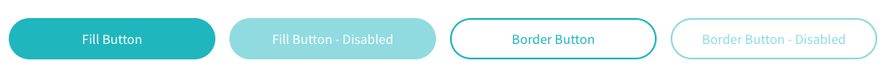

title: Ugla | Componente Button
description: Conhecendo e implementando Button

# Button

O componente Button é responsável por criar botões e gerenciar o status deles.

[](buttons.png)

## Atributos da tag


Atributo      | Input/Output   | Tipo           | Obrigatório    | Valores padrões
:------------ | :------------: | :--------------| :------------- | :-------------
id            | `@Input`       | `String`       | Sim            | -
size          | `@Input`       | `String`       | Não            | -
theme [^1]    | `@Input`       | `String`       | Sim            | -
color         | `@Input`       | `String`       | Sim            | aquamarine
style         | `@Input`       | `String`       | Sim            | fill
wave          | `@Input`       | `Boolean`      | Sim            | -
title         | `@Input`       | `String`       | Sim            | -
disabled      | `@Input`       | `Boolean`      | Sim            | false
type          | `@Input`       | `String`       | Sim            | button
tabindex      | `@Input`       | `Number`       | Sim            | 0
flating       | `@Input`       | `String`       | Sim            | -
action        | `@Output`      | `function`     | Sim            | -

!!! info "Size"
    O atributo size aceita os valores `large`, `medium`, `small` e o tamanho padrão é `medium`.

!!! info "Color"
    O atributo campo aceita as cores: `aquamarine`, `red`, `gray`, `green`, `purple` e a cor padrão é `aquamarine`.

!!! info "Style"
    O atributo Style aceita os valores: `fill`, `border` e `icon` e o valor padrão é `fill`.
    Use o valor `fill` quando quiser que a cor selecionada preencha o background do botão.
    Use o valor `broder` quando quiser que a cor selecionada preencha apenas a borda do botão, assim o background será branco.
    E use o valor `icon` quando quiser o botão preenchido porém, com um botão alinhado a esquerda.

## Como usar

```html tab='HTML'
<ugl-button
      [id]="'test'"
      [size]="'medium'"
      [color]="'aquamarine'"
      [style]="'fill'"
      [wave]="true"
      [title]="'Title button'"
      [disabled]="false"
      [type]="'button'"
      [tabindex]="1"
      [floating]="false"
      (action)="clickButton()">Fill Button</ugl-button>
```

```ts tab="TS"
clickButton() {
  console.log("Button clicked")
}
```

[^1]: Necessário análise se de fato é necessário.