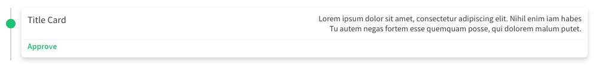

import Tabs from '@theme/Tabs';
import TabItem from '@theme/TabItem';

O componente **Card Timeline** foi criado para criar linhas do tempo com multiplos cards.


## Atributos da tag

Atributo    | Input/Output   | Tipo      | Obrigatório    | Valores padrões
:---------- | :------------: | :-------- | :------------- | :-------------
id          | `@Input`       | `String`  | Não            | -
title       | `@Input`       | `String`  | Não            | -
info1       | `@Input`       | `String`  | Não            | -
info2       | `@Input`       | `String`  | Não            | -
status      | `@Input`       | `String`  | Não            | -
color       | `@Input`       | `String`  | Não            | gray
cardClicked | `@Output`      | `function`| Não            | -

:::info Valores para color
O atributo **color** aceita as seguintes strings: `gray`, `red`, `yellow`, `green` e `aquamarine` e seu valor padrão é `gray`.
:::

## Como usar

<Tabs
  defaultValue="html"
  values={[
    { label: 'HTML', value: 'html', },
    { label: 'Typescript', value: 'typescript', }
  ]
}>
<TabItem value="html">

```html
<ugl-card-timeline
  [id]="'card-1'"
  [title]="'Title Card'"
  [info1]="'Lorem ipsum dolor sit amet, consectetur adipiscing elit. Nihil enim iam habes'"
  [info2]="'Tu autem negas fortem esse quemquam posse, qui dolorem malum putet.'"
  [status]="'Approve'"
  [color]="'green'"
  (cardClicked)="cardClick($event)"></ugl-card-timeline>
```

</TabItem>

<TabItem value="typescript">

```typescript
cardClick($event: any) {}
```

</TabItem>
</Tabs>
