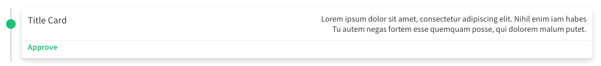

title: Ugla | Componente Card Timeline
description: Conhecendo e implementando Card Timeline

# Card Timeline
O componente **Card Timeline** foi criado para criar linhas do tempo com multiplos cards.

[](card-timeline.png)

## Atributos da tag

Atributo    | Input/Output   | Tipo      | Obrigatório    | Valores padrões
:---------- | :------------: | :-------- | :------------- | :-------------
id          | `@Input`       | `String`  | Não            | -
title       | `@Input`       | `String`  | Não            | -
info1       | `@Input`       | `String`  | Não            | -
info2       | `@Input`       | `String`  | Não            | -
status      | `@Input`       | `String`  | Não            | -
color       | `@Input`       | `String`  | Não            | gray
cardClicked | `@Output`      | `function`| Não            | -

!!! info "Valores para color"
    O atributo **color** aceita as seguintes strings: `gray`, `red`, `yellow`, `green` e `aquamarine` e seu valor padrão é `gray`.

## Como usar

```html tab='HTML'
<ugl-card-timeline
  [id]="'card-1'"
  [title]="'Title Card'"
  [info1]="'Lorem ipsum dolor sit amet, consectetur adipiscing elit. Nihil enim iam habes'"
  [info2]="'Tu autem negas fortem esse quemquam posse, qui dolorem malum putet.'"
  [status]="'Approve'"
  [color]="'green'"
  (cardClicked)="cardClick($event)"></ugl-card-timeline>
```

```typescript tab='TS'
cardClick($event: any) {
}
```
