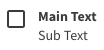

import Tabs from '@theme/Tabs';
import TabItem from '@theme/TabItem';



Gera um checkbox com título e texto auxiliar.

## Atributos da tag

Atributo      | Input/Output   | Tipo        | Obrigatório
:------------ | :------------: | :---------- | -------------:
mainText      | `@Input`       | `String`    | Não
name          | `@Input`       | `String`    | Sim
subText       | `@Input`       | `String`    | Não
disabled      | `@Input`       | `Boolean`   | Sim
isChecked     | `@Input`       | `Boolean`   | Sim
checked       | `@Output`      | `function`  | Sim

## Como usar

<Tabs
  defaultValue="html"
  values={[
    { label: 'HTML', value: 'html', },
    { label: 'Typescript', value: 'typescript', }
  ]
}>
<TabItem value="html">

```html
<ugl-checkbox
		[mainText]="'Main Text'"
		[name]="'list'"
		[subtext]="'Sub Text'"
		[disabled]="false"
		[isChecked]="false"
		[checked]="checked()"></ugl-checkbox>
```

</TabItem>

<TabItem value="typescript">

```typescript
checked() {}
```

</TabItem>
</Tabs>
