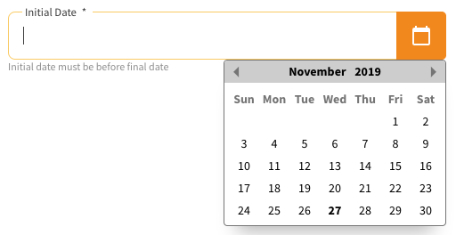
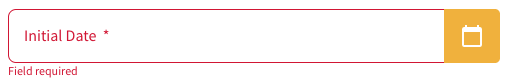

import Tabs from '@theme/Tabs';
import TabItem from '@theme/TabItem';






O componente datepicker gera um campo input com ícone de calendário.
Para sua criação, foi usado a biblioteca `js-datepicker`[^1] e a biblioteca `moment`[^2].

## Atributos da tag

Atributo                | Input/Output   | Tipo        | Obrigatório
:---------------------- | :------------: | :---------- | -------------:
name                    | `@Input`       | `String`    | Não
label                   | `@Input`       | `String`    | Sim
message                 | `@Input`       | `String`    | Não
options                 | `@Input`       | `any`       | Sim
disabled                | `@Input`       | `Boolean`   | Sim
required                | `@Input`       | `Boolean`   | Sim
invalid                 | `@Input`       | `Boolean`   | Sim
messageInvalidSelection | `@Input`       | `String`    | Sim
messageRequired         | `@Input`       | `String`    | Sim
language                | `@Input`       | `String`    | Sim
onSelectValue           | `@Output`      | `function`  | Sim

:::info Atribuito invalidInitialDate
Quando o atributo receber o valor `false`, ele será exibido corretamente. Quando receber `true`, ele será assumirá o estado de erro.
:::

:::info Atributo language
O atributo language precisa receber um valor conforme a tabela encontrada no [Stackoverflow](https://stackoverflow.com/a/55827203/1556370), este valor é usado para formatar corretamente a data.
:::

:::info Atributo options
Para preencher corretamente o atributo options, veja a documentação do [js-datepicker](https://github.com/qodesmith/datepicker).
:::

## Como usar

<Tabs
  defaultValue="html"
  values={[
    { label: 'HTML', value: 'html', },
    { label: 'Typescript', value: 'typescript', },
    { label: 'Console', value: 'bash', }
  ]
}>
<TabItem value="html">

```html
<ugl-datepicker [label]="'Inital Date'"
                [name]="'initialDate'"
                [options]="onInitDatepicker()"
                [message]="'Initial date must be before final date'"
                [messageRequired]="'Field required'"
                [invalid]="false"
                [required]="true"
                [messageInvalidSelection]="'This date is invalid for selection'"
                [language]="'pt-BR'"
                (onSelectValue)="onChangeInitialDate($event)"
                #initialDate></ugl-datepicker>
```

</TabItem>

<TabItem value="typescript">

```typescript
// Options
onInitDatepicker() {
  return {
    startDate: new Date(),
    position: 'br'
  };
}

onChangeInitialDate(date: Date) {
  console.log(date)
}
```
</TabItem>

<TabItem value="bash">

```bash
Wed Nov 27 2019 00:00:00 GMT-0300 (Horário Padrão de Brasília)
```

</TabItem>
</Tabs>


## Problemas na Modal

:::caution Usando juntamente com o serviço [Modal](/docs/services/modal)
Para que o datepicker funcione corretamente dentro de uma modal, o options precisa ser carregado somente após a chamada da modal e, dentro de um timeout.
:::

<Tabs
  defaultValue="html"
  values={[
    { label: 'HTML', value: 'html', },
    { label: 'Typescript', value: 'typescript', }
  ]
}>
<TabItem value="html">

```html
<ugl-modal
    (cancelClick)="cancel()"
    (confirmClick)="confirm()"
    [cancelButtonText]="'Cancel'"
    [confirmButtonText]="'Confirm'">

    <ugl-datepicker [label]="'Inital Date'"
                    [name]="'initialDate'"
                    [options]="onInitDatepicker()"
                    [message]="'Initial date must be before final date'"
                    [messageRequired]="'Field required'"
                    [invalid]="false"
                    [required]="true"
                    [messageInvalidSelection]="'This date is invalid for selection'"
                    [language]="'pt-BR'"
                    (onSelectValue)="onChangeInitialDate($event)"
                    #initialDate></ugl-datepicker>
</ugl-modal>
```

</TabItem>

<TabItem value="typescript">

```typescript
// Options
options = null;

cancel() {
    this.modal.closeModal();
  }

confirm() {
  this.modal.closeModal();

  setTimeout({() => this.options = this.onInitDatepicker()}, 1);
}

// Options
onInitDatepicker() {
  return {
    startDate: new Date(),
    position: 'br'
  };
}

onChangeInitialDate(date: Date) {
  console.log(date)
}
```
</TabItem>
</Tabs>

[^1]: `js-datepicker: ^4.6.6`: https://www.npmjs.com/package/js-datepicker
[^2]: `moment: ^2.24.0`: https://www.npmjs.com/package/moment 