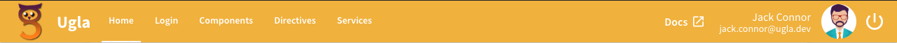

import Tabs from '@theme/Tabs';
import TabItem from '@theme/TabItem';

O componente **Header** é composto por mais dois componentes: [Brand](brand), que é responsável pelo ícone e nome do sistema presentes na tela e [People Card](people-card), que carrega os dados do usuário logado e o botão de **Logout**.



## Atributos da tag

Atributo      | Input/Output   | Tipo                          | Obrigatório    | Valores padrões
:------------ | :------------: | :---------------------------- | :------------- | :-------------
header        | `@Input`       | [Header](/docs/models/header) | Sim            | -
logoutText    | `@Input`       | `String`                      | Não            | Logout
logoutAction  | `@Output`      | `function`                    | Sim            | -

## Class Header e subclasses

Para construir o o header, é necessário criar uma instância da classe [Header](/docs/models/header).

Os dados do usuário são registrados ao criar uma instãncia da classe [People](/docs/models/people), e ela deve ser incluso ao objeto header `header.people`.

O menu é criado usando as classes [Menu](/docs/models/menu) e [Menu Item](/docs/models/menu-item) que também deve ser incluso ao objeto header `header.menu`;

O componente **Header** pode ter sombras, e para habilitá-la é necessário injetar o [Ugla Service](/docs/services/ugla-service) e, em seguida, atribuir `true/false` a variável:

```typescript
constructor(private ugla: UglaService) {}

ngOnInit() {
  this.ugla.headerShadow = true;
}
```

## Exemplo completo

<Tabs
  defaultValue="html"
  values={[
    { label: 'HTML', value: 'html', },
    { label: 'Typescript', value: 'typescript', }
  ]
}>
<TabItem value="html">

```html
<ugl-header
    [header]='header'
    (logoutAction)='logout($event)'
    [logoutText]=''Logout now''>
</ugl-header>
```

</TabItem>

<TabItem value="typescript">

```typescript
import { Header, People, Menu, MenuItem, Select, Options, UglaService } from 'ugla';

@Component({
  selector: 'app-root',
  templateUrl: './app.component.html',
  styleUrls: ['./app.component.scss']
})
export class AppComponent implements OnInit {
  constructor(private ugla: UglaService) {}

  header = new Header('Ugla', './assets/imgs/logo.png', 'home', true);

  people = new People('Jack Connor', 'jack.connor@ugla.dev', './assets/imgs/people.png');

  menu = new Menu([
    new MenuItem('Home', '/', true),
    new MenuItem('Login', '/login', true),
    new MenuItem('Components', '/components', true),
    new MenuItem('Directives', '/directives', true),
    new MenuItem('Services', '/services', true)
  ]);

  ngOnInit() {
    this.header.people = this.people;
    this.header.menu = this.menu;
    this.ugla.headerShadow = true;
  }

  logout(status) {
    console.log('Logout');
  }

  selectLanguage(language) {
    console.log(`Language selected is ${language.description} and the code is ${language.value}`);
  }
}
```

</TabItem>
</Tabs>
