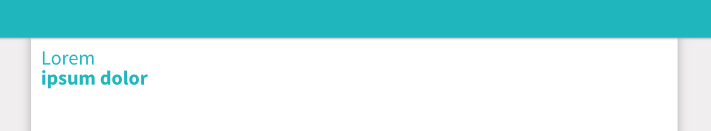

O componente Page Title é responsável por gerar um título a página sob a tag H2.



## Atributos da tag

Atributo          | Input/Output   | Tipo           | Obrigatório    | Valores padrões
:---------------- | :------------: | :--------------| :------------- | :-------------
firstTitle        | `@Input`       | `String`       | Sim            | -
secondTitle       | `@Input`       | `String`       | Não            | -

:::info Cor do texto
A cor do texto é por padrão a cor selecionada para o tema.
:::

## Como usar

```html
<ugl-page-title
  [firstTitle]="'Lorem'"
  [secondTitle]="'ipsum dolor'"></ugl-page-title>
```