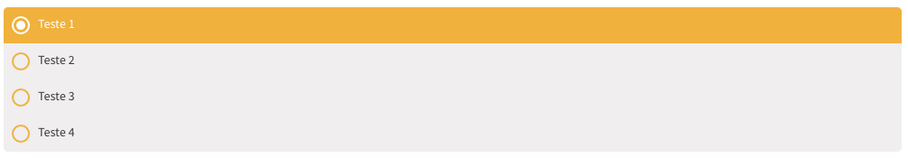

title: Ugla | Componente Radio
description: Conhecendo e implementando Radio

# Radio
[](radio.png)
_Imagem do radio_

## Atributos da tag

Atributo            | Input/Output   | Tipo                                 | Obrigatório
:------------------ | :------------: | :----------------------------------- | -------------:
items               | `@Input`       | [Options](../../models/options)`[]`  | Não
radioGroupAriaLabel | `@Input`       | `String`                             | Sim
itemChecked         | `@Output`      | `function`                           | Não

## Como usar

```html tab='HTML'
<ugl-radio
    [items]="list"></ugl-radio>
```

```typescript tab='TS'
list = [
  new Options('Teste 1', '1'),
  new Options('Teste 2', '2'),
  new Options('Teste 3', '3'),
  new Options('Teste 4', '4'),
];
```
