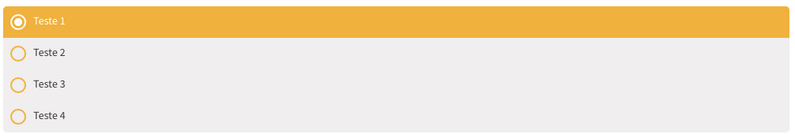

import Tabs from '@theme/Tabs';
import TabItem from '@theme/TabItem';


_Imagem do radio_

## Atributos da tag

Atributo            | Input/Output   | Tipo                                 | Obrigatório
:------------------ | :------------: | :----------------------------------- | -------------:
items               | `@Input`       | [Options](/docs/models/options)`[]`  | Não
radioGroupAriaLabel | `@Input`       | `String`                             | Sim
itemChecked         | `@Output`      | `function`                           | Não

!!! info "Arial Label"
    O atributo `radioGroupAriaLabel` é usado melhorar a leitura do componente por leitores de tela.

## Como usar

<Tabs
  defaultValue="html"
  values={[
    { label: 'HTML', value: 'html', },
    { label: 'Typescript', value: 'typescript', }
  ]
}>
<TabItem value="html">

```html
<ugl-radio
    [items]="list"
    [radioGroupAriaLabel]="'Lista exemplo de radio'"
    (itemChecked)="radioChecked($event)"></ugl-radio>
```

</TabItem>

<TabItem value="typescript">

```typescript
list = [
  new Options('Teste 1', '1'),
  new Options('Teste 2', '2'),
  new Options('Teste 3', '3'),
  new Options('Teste 4', '4'),
];

radioChecked(item: Options) {
  console.log(`O item ${item.description} foi selecionado e seu valor é ${item.value}.`);
}
```

</TabItem>
</Tabs>
