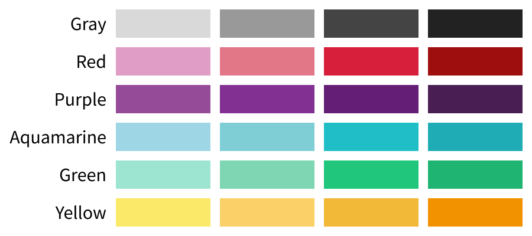
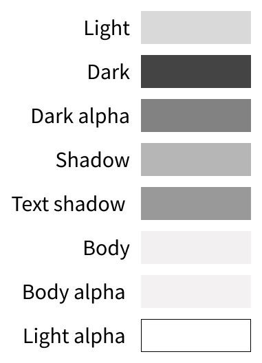

O Ugla oferece um conjunto de cores que podem se usada de diversas maneiras.

## Classes
As cores base do Ugla são: `aquamarine`, `red`, `green`, `yellow`, `red` e `gray`, e para cada um existe uma classe que adiciona o atributo `color`.

Class                | Cor           | Hexadecimal | Representação
:------------------- | :------------ | ----------- | ------------------------------------------------------------------:
`.color-gray`        | Cinza         | #656565     | 
`.color-red`         | Vermelha      | #D71F3C     | 
`.color-purple`      | Roxo          | #641E75     | 
`.color-aquamarine`  | Aquamarine    | #20BEC6     | 
`.color-green`       | Verde         | #20C67B     | 
`.color-yellow`      | Amarelo       | #F2B838     | 

Além das classes para color, o Ugla oferece também classes para o atributo `background`:

Class                     | Cor           | Hexadecimal | Representação
:------------------------ | :------------ | ----------- | ------------------------------------------------------------------:
`.background-gray`        | Cinza         | #656565     | 
`.background-red`         | Vermelha      | #D71F3C     | 
`.background-purple`      | Roxo          | #641E75     | 
`.background-aquamarine`  | Aquamarine    | #20BEC6     | 
`.background-green`       | Verde         | #20C67B     | 
`.background-yellow`      | Amarelo       | #F2B838     | 

## SCSS
Mas existem outras maneiras de usar a cores, uma delas é com uma function do SCSS: `color()`. Para fazer uso da função, basta chamá-la a frente de um atributo de cor, passando o nome do theme e a tonalidade da cor desejada.
Os temas são: `aquamarine`, `red`, `green`, `yellow`, `red` e `gray`, além desses temos um agrupador chamado `others` que contém outras cores necessárias.
As intencidades de cor são: `extra-light`, `light`, `medium`, `dark`.
Todo tema precisa iniciar com `_`.

### Exemplo
```scss
p {
  color: color(_aquamarine, medium);
}

div {
  background-color: color(_gray, dark);
}
```

## Tabela de cores


Theme        | Extra Light | Light         | **Medium** | Dark
:----------- | :---------: | :-----------: | :-------:  | :--------:
Gray         | #d9d9d9     | #999999       | #444444    | #222222  
Red          | #e09ec6     | #e27887       | #d71f3c    | #9f0e0e  
Purple       | #954b97     | #823193       | #641e75    | #491f53  
Aquamarine   | #9ed6e5     | #7fced6       | #20bec6    | #20acb4  
Green        | #9ee5d1     | #7fd6b3       | #20c67b    | #20b472  
Yellow       | #fbe96a     | #fbd068       | #f2b838    | #f39200  


## Others
O others possuí diversos atributos e seu uso é:

```scss
p {
  color: color(_others, <variante>)
}
```



Variante    | Representação
:---------- | :------------:
light       | #fff
dark        | #444444
dark-alpha  | rgba(68, 68, 68, .67);
shadow      | #b6b6b6;
text-shadow | #999999;
body        | #f2f0f0;
body-alpha  | rgba(242, 240, 240, .9);
light-alpha | rgba(255, 255, 255, 0);

