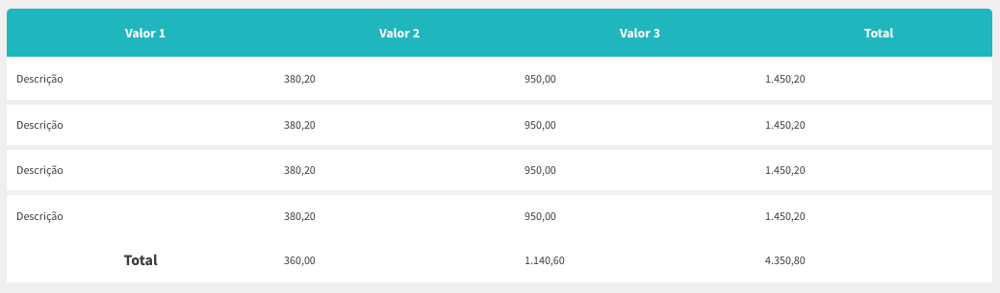

title: Ugla | Table
description: Conhecendo e implementando as Tables

# Tables
Para estilização das tabelas, existe uma classe que formata toda a tabela sem dificuldades.
Para tal, é necessário seguir a semantica descrita abaixo:

Necessário inseruir a classe `.base-table` para que seja totalmente formatada. E, para definir a cor do  header, basta usar uma das classes de thema:

Class                        | Cor           | Hexadecimal | Representação
:--------------------------- | :------------ | ----------- | ------------------------------------------------------------------:
`.theme-colored-gray`        | Cinza         | #656565     | [](_images/gray.png)
`.theme-colored-red`         | Vermelha      | #D71F3C     | [](_images/red.png)
`.theme-colored-purple`      | Roxo          | #641E75     | [](_images/purple.png)
`.theme-colored-aquamarine`  | Aquamarine    | #20BEC6     | [](_images/aquamarine.png)
`.theme-colored-green`       | Verde         | #20C67B     | [](_images/green.png)
`.theme-colored-yellow`      | Amarelo       | #F2B838     | [](_images/yellow.png)

É possível também alinhar a tabela ao centro da tela usando a classe `.central`.
E, é possível manter a tabela como header fixo na tela usando a claase `.fixed`.

## Implementação

```html tab='HTML'
<table class="base-table central theme-colored-aquamarine">
    <thead>
      <tr>
        <th>Valor 1</th>
        <th>Valor 2</th>
        <th>Valor 3</th>
        <th>Total</th>
      </tr>
    </thead>
    <tbody>
      <tr>
        <td>Descrição</td>
        <td>380,20</td>
        <td>950,00</td>
        <td>1.450,20</td>
      </tr>
      <tr>
        <td>Descrição</td>
        <td>380,20</td>
        <td>950,00</td>
        <td>1.450,20</td>
      </tr>
      <tr>
        <td>Descrição</td>
        <td>380,20</td>
        <td>950,00</td>
        <td>1.450,20</td>
      </tr>
      <tr>
        <td>Descrição</td>
        <td>380,20</td>
        <td>950,00</td>
        <td>1.450,20</td>
      </tr>
    </tbody>
    <tbody>
      <tr>
        <th>Total</th>
        <td>360,00</td>
        <td>1.140,60</td>
        <td>4.350,80</td>
      </tr>
    </tbody>
  </table>
</section>
```

## Exemplo
[](_images/table.png)