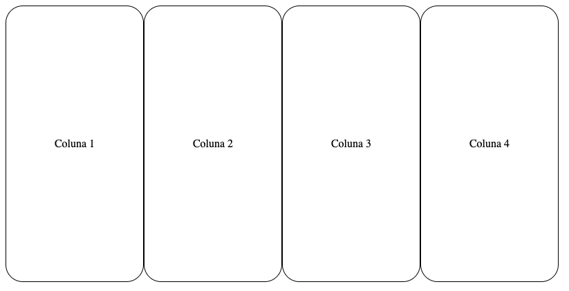
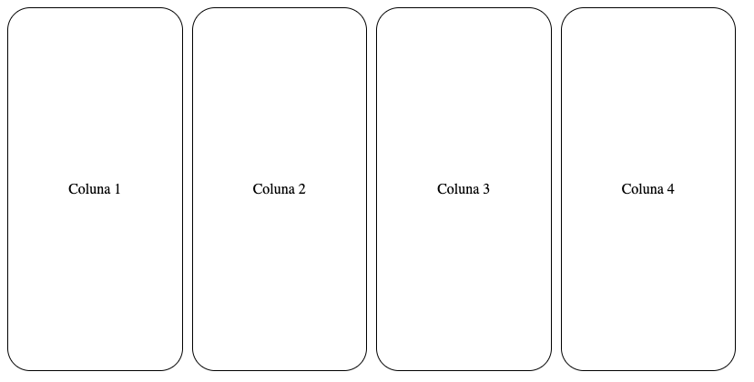
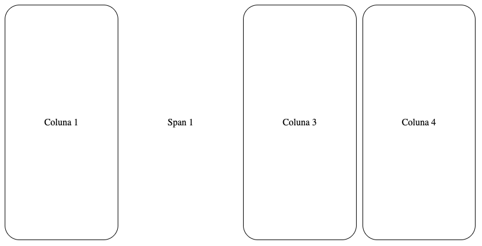

title: Ugla | Directives Grid
description: Conhecendo e implementando Grid

# Grid
A diretiva **Grid** deve ser usada para criar os grids nas páginas.
É possível usar a diretiva em qualquer elemento HTML.


## Ativando
```html
<div uglGrid [grid]="true"></div>
```

## Atributos aceitos na tag

Atributo      | Input/Output   | Tipo       | Obrigatório    | Valores padrões
:------------ | :------------: | :----------| :------------- | :-------------
uglGrid       | `@Input`       | -          | Sim            | -
grid          | `@Input`       | `Boolean`  | Não            | false
col           | `@Input`       | `Number`   | Não            | -
colSm         | `@Input`       | `Number`   | Não            | -
gap           | `@Input`       | `Number`   | Não            | -
gapSm         | `@Input`       | `Number`   | Não            | -
span          | `@Input`       | `Number`   | Não            | -
spanSm        | `@Input`       | `Number`   | Não            | -
customCol     | `@Input`       | `String`   | Não            | -

!!! info "[uglGrid]"
    Este é um atributo obrigatório, ele inicializa a diretiva no elemento html.

!!! info "[grid]"
    Este atributo pode receber os valores `true` e `false`, quando true, indica que o elemento é um elemento de grid, o que quer dizer que é nele que serão atribuido os valores das colunas.

!!! info "[col] e [colSm]"
    Estes atributos recebem valores numéricos de `1` à `12`, e eles que determina a quantidade de colunas que estarão no grid. As colunas terão sempre o mesmo tamanho.
    
    * [col] - deve ser usado para desktop
    * [colSm] - deve ser usado para mobile

!!! info "[gap]"
    Este atributo adiciona um espaço entre as colunas. Ele aceita qualquer valor numérico e este será convertido para a medida `rem`. Assim, se for atribuído `[gap]="1"` será adicionado `1rem` na distância entre as colunas.

    * [gap] - deve ser usado para desktop
    * [gapSm] - deve ser usado para mobile

!!! info "[span]"
    Este atributo adiciona uma ou mais colunas a direita do elemento que recebe o atributo. Ele aceita um valor numérico e o atributo não deve ser utilizado no elemento grid e sim em um elemento filho.

    * [span] - deve ser usado para desktop
    * [spanSm] - deve ser usado para mobile

!!! info "[customCol]"
    Este atributo cria colunas com valor customizado. Ele aceita valores com medidas padrão do CSS (px, rem, %). Para usar, basta passar a largura de cada coluna da seguinte maneira: `[customCol]="'50% 25% 25%'"`, nesse exemplo, serão criados três colunas, sendo a primeira com o tamanho de 50%, o segundo com 25% e o terceiro com 25%. Ainda é possível usar os atributos `[gap]` e `[gapSm]`.

## Exemplo de código

```html tab='Implementação'
<div uglGrid [grid]="true" [col]="4" [colSm]="2" [gap]="1" [gapSm]="2">
  <div uglGrid [span]="1" [spanSm]="2">Coluna 1</div>
  <div>Coluna 2</div>
  <div>Coluna 3</div>
</div>
```

```html tab='Resultado'
<div class="grid col-4 col-sm-2 gap-1 gap-sm-2">
  <div class="span-1 span-sm-2">Coluna 1</div>
  <div>Coluna 2</div>
  <div>Coluna 3</div>
</div>
```

### Com colunas customizadas

```html tab='Implementação'
<div uglGrid [grid]="true" [customCol]="'50% 25% 25%'">
  <div>Coluna 50%</div>
  <div>Coluna 25% 1</div>
  <div>Coluna 25% 2</div>
</div>
```

```html tab='Resultado'
<div class="grid" style="grid-template-columns: 50% 25% 25%;">
  <div>Coluna 50%</div>
  <div>Coluna 25% 1</div>
  <div>Coluna 25% 2</div>
</div>
```

### Exibição
[](_images/grid-1.png)
_[grid]="true" [col]="4"_

[](_images/grid-2.png)
_[grid]="true" [col]="4" [gap]="1"_

[](_images/grid-3.png)
_[span]="1"_