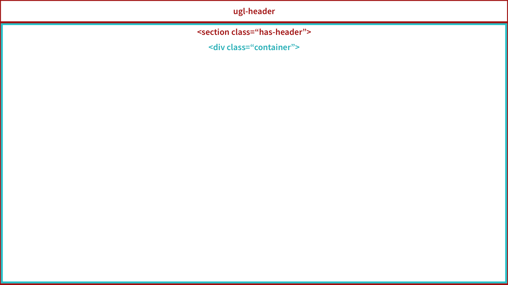
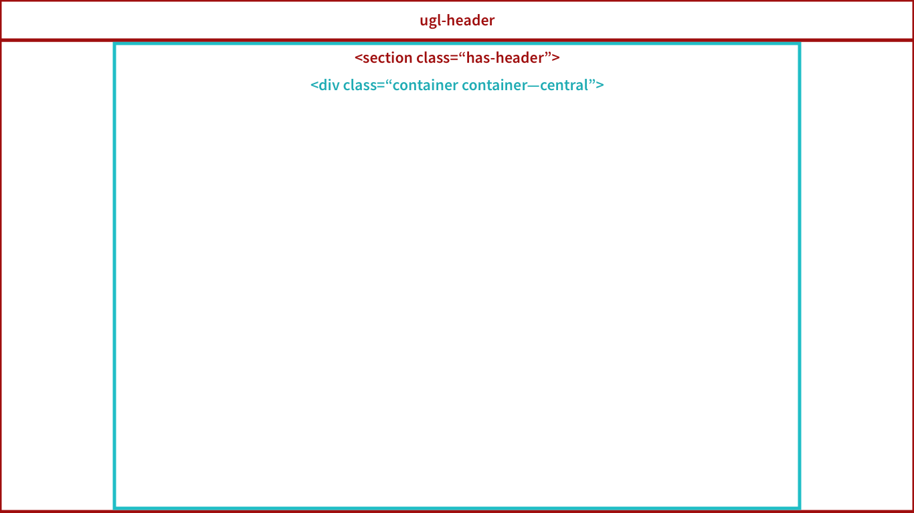
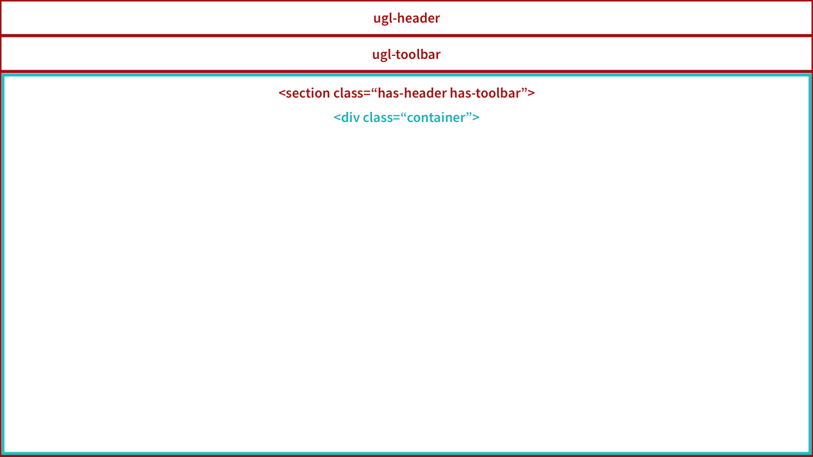
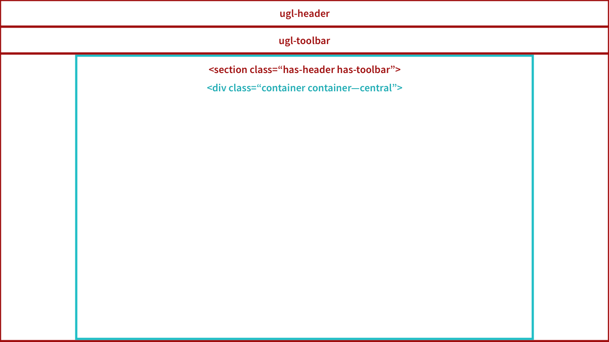

title: Ugla | Estrutura de páginas
description: Conhecendo e implementando a estrutura para páginas

# Páginas

O Ugla aprenseta um padrão de estrutura HTML e um conjunto de classes para facilitar a implementação do seu Frontend.

Desta forma, o conteúdo saberá onde deve iniciar na tela quando seu projeto usar um menu ou, um menu lateral, ou menos um breadcrumb.

## Estrutura
Toda página deve ser iniciada com uma tag `<section>` e essa tag deve receber um conjunto de classes que indiquem se está sendo aplicado um header, toolbar, aside e breadcrumb.

Classe         | Função
:------------- | :------------
.has-header     | Indica que há a existencia do componente [Header](../components/header) fixo no topo
.has-toolbar    | Indica o uso do componente [Toolbar](../components/toolbar)
.has-aside      | Indica que está sendo usado o componente [Aside](../components/aside)
.has-breadcrumb | Indica que o componente [Breadcrum](../components/breadcrumb) foi adicionado a tela

### Exemplos
O exemplo abaixo mostra como seria a implementação da section quando há um header e uma toolbar implementadas.

```html
<section class="has-header has-toolbar">
</section>
```

Todo componente flutuante deve ficar fora da tag `<section>`, por exemplo:

```html
<ugl-header [header]="header"></ugl-header>
<ugl-toolbar [title]="'Example'"></ugl-toolbar>

<section class="has-header has-toolbar"></section>
```

## Container
Dentro da tag `<section>` adicionamos uma tag `<div>` com a classe que representa um container `.container` e, junto ele, podemos adicionar classes que modificam o container.

Classe                 | Função
:--------------------- | :------------
.container             | Indica a área onde todo o contaúdeo exibido será carregado
.container--central    | Alinha todo o contaúdo ao centro, mantendo uma largura máxima de 1024px no desktop
.container--white      | Adicionar cor de fundo branca e uma sombra projetada

### Exemplo
```html
<section class="has-header has-toolbar">
  <div class="container container--central container--white">
  </div>
</section>
```

## Diagramas de exemplo

### 1. Página com Header e Container padrão
[](_images/has-header_container.png)

### 2. Página com Header e Container centralizado
[](_images/has-header_container-centered.png)

### 3. Página com Header, Toolbar e Container padrão
[](_images/has-header_has_toolbar-container.png)

### 4. Página com Header, Toolbar e Container centralizado
[](_images/has-header_has_toolbar-container-centered.png)