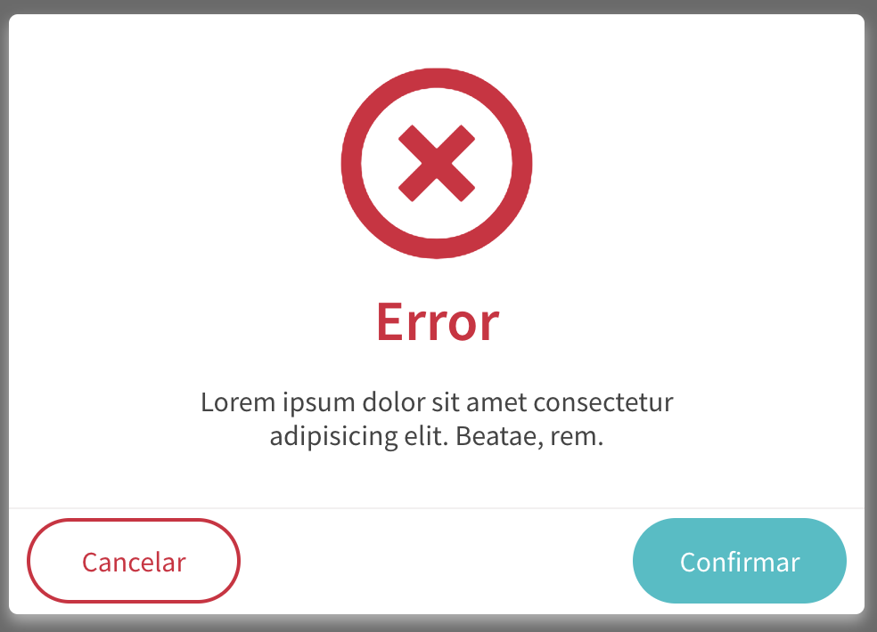
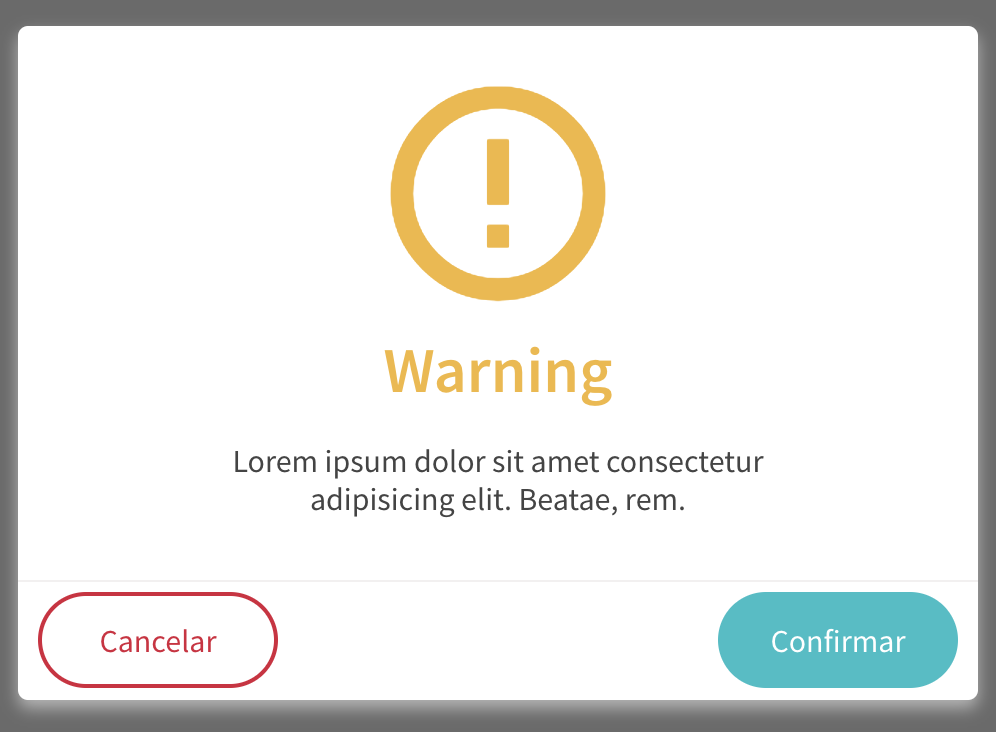
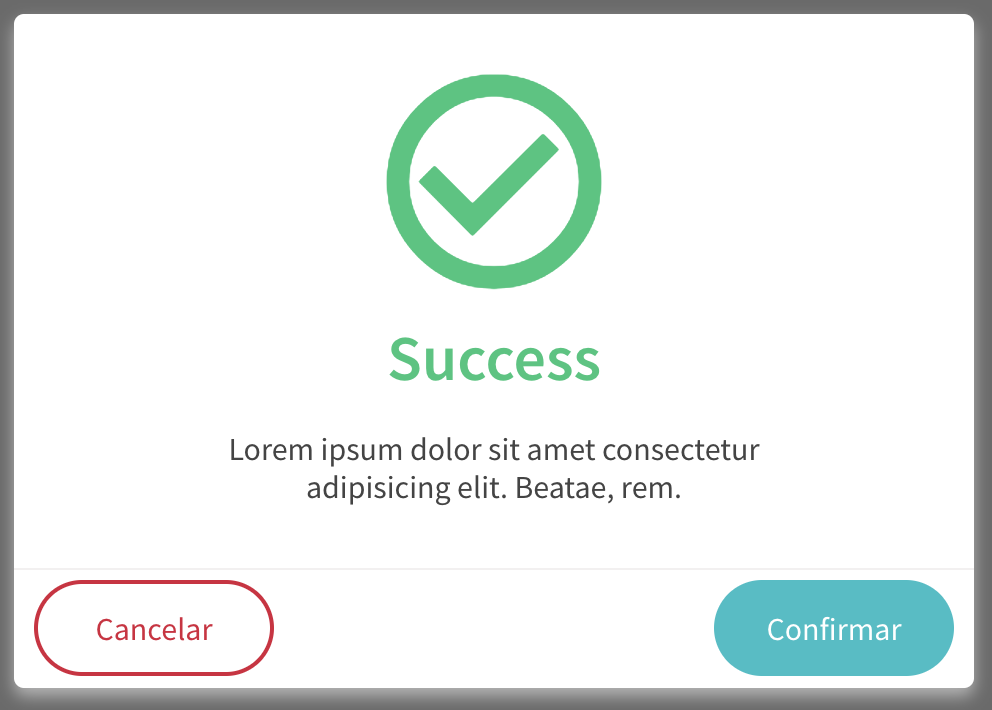
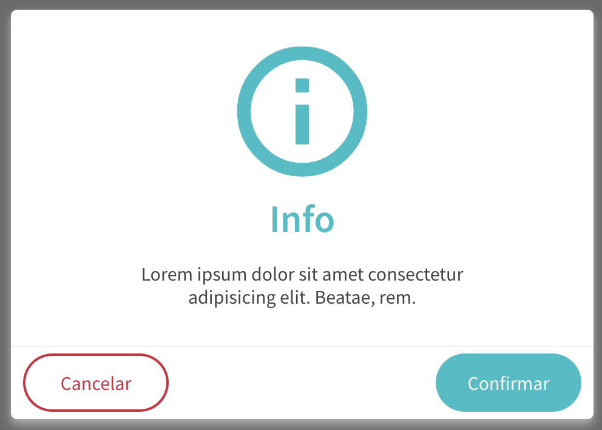

title: Ugla | Serviço Modal
description: Conhecendo e implementando Modal

# Modal
Para que o serviço Modal funcione corretamente, é necessário seguir alguns pequenos passos.

## Componente
O Modal é dividido em duas estruturas: Serviço e Componente e para que funcione corretamente, ambas devem estar implementadas em seu código.

Começaremos com o componente, que é a base para o bom funcionamento:
Inclua o a tag abaixo na página que chamará a modal, preencha os atributos e, entre as tags poderá adicionar qualquer conteúdo que deseje. É comum na área do content (entre as tags), includir todas as variações de conteúdo permitidas na tela e via variavel definir qual será exibida ou oculta.

### Atributos da tag
Atributo           | Input/Output   | Tipo           | Obrigatório    | Valores padrões
:----------------- | :------------: | :--------------| :------------- | :-------------
cancelClick        | `@Output`      | `function`     | Não            | -
confirmClick       | `@Output`      | `function`     | Sim            | -
cancelButtonText   | `@Input`       | `String`       | Sim            | -
confirmButtonText  | `@Input`       | `String`       | Sim            | -

!!! info "cancelButtonText" e "confirmButtonText"
    Estes atributos devem ser preenchidos com o texto que será exibido nos botões

!!! info "cancelClick" e "confirmClick"
    Os outputs são necessário para informar o que os botões de confirmação e cancelamento devem fazer. Para que a modal seja fechada após clicar neles, chame o método do serviço: `close()`.


```html tab="HTML"
<ugl-modal
    (cancelClick)="cancel()"
    (confirmClick)="confirm()"
    [cancelButtonText]="'Cancel'"
    [confirmButtonText]="'Confirm'">

    <p>Text</p>

    </ugl-modal>
```

```typescript tab="TS"
cancel() {
    this.modal.closeModal();
  }

confirm() {
  this.modal.closeModal();
}
```

## O serviço
Após adicionar a tag contendo os atributos, é hora de implementar o serviço e executar a abertura da modal.
A modal oferece 4 métodos de abertura, ambos seguindo um padrão muito semelhantes:

```typescript
this.modal.<type>(<title>, <message>, <Has Icon?>);
```


### Warning
```typescript
this.modal.error(
  'Error',
  'Lorem ipsum dolor sit amet consectetur adipisicing elit. Beatae, rem.',
  true
);
```
[](_images/modal-error.png)

### Error
```typescript
this.modal.warning(
  'Warning',
  'Lorem ipsum dolor sit amet consectetur adipisicing elit. Beatae, rem.',
  true
);
```

[](_images/modal-warning.png)


### Success
```typescript
this.modal.success(
  'Success',
  'Lorem ipsum dolor sit amet consectetur adipisicing elit. Beatae, rem.',
  true
);
```
[](_images/modal-success.png)

### Info
```typescript
this.modal.info(
  'Info',
  'Lorem ipsum dolor sit amet consectetur adipisicing elit. Beatae, rem.',
  true
);
```
[](_images/modal-info.png)